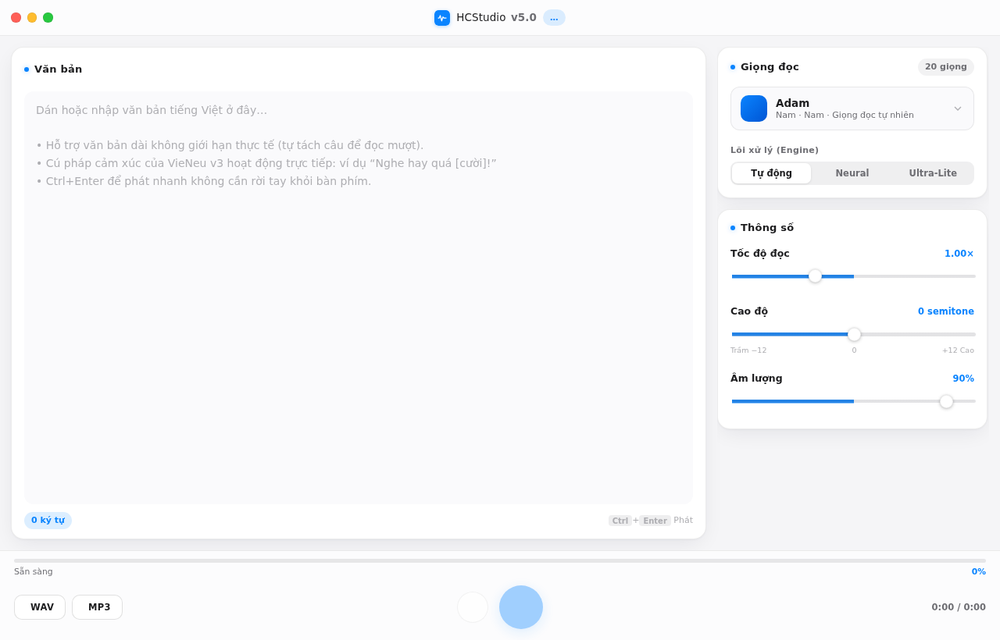
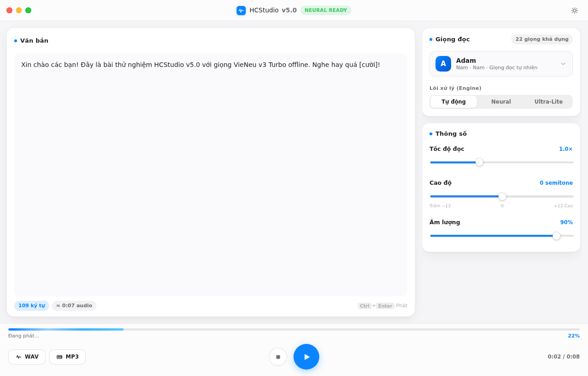
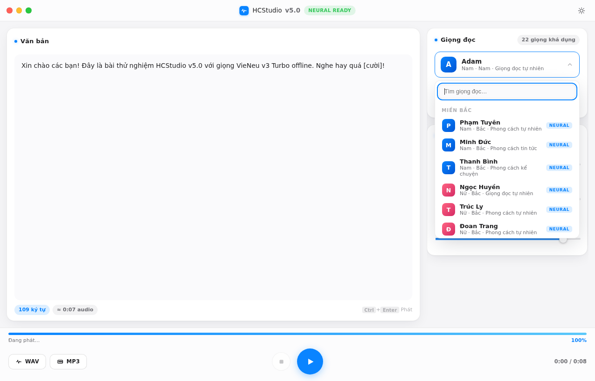
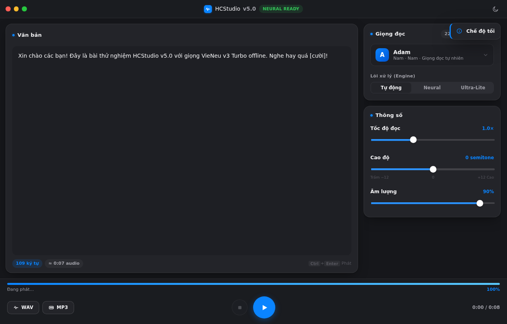

# 🎙️ HCStudio v5.0

> Trình đọc văn bản tiếng Việt **offline hoàn toàn** cho Windows.
> 20 giọng neural tự nhiên · Hybrid Engine · Một tệp `.exe` duy nhất · Không port, không CMD.

HCStudio v5.0 được xây trên nền tảng ba mã nguồn mở của cộng đồng VieNeu-TTS:

| Nguồn | Vai trò trong HCStudio |
|---|---|
| [`pnnbao-ump/VieNeu-TTS-v3-Turbo`](https://huggingface.co/pnnbao-ump/VieNeu-TTS-v3-Turbo) (Apache-2.0) | Mô hình neural 48 kHz, **đúng 20 giọng preset gốc** Bắc/Trung/Nam |
| [`pnnbao97/VieNeu-TTS`](https://github.com/pnnbao97/VieNeu-TTS) | Tham chiếu pipeline Python + bản chuẩn `voices_v3_turbo.json` |
| [`pnnbao97/VieNeu-TTS.cpp`](https://github.com/pnnbao97/VieNeu-TTS.cpp) (MIT) | Engine C++ C-ABI được **link tĩnh** vào binary Go qua cgo |

## ✨ Tính năng

- **20 giọng VieNeu v3 Turbo nguyên bản** — Nam/Nữ × Miền Bắc/Trung/Nam ×
  Tự nhiên / Tin tức / Kể chuyện / Sách nói. Kèm codec cảm xúc inline:
  `[cười]`, `[thở dài]`, `[hắng giọng]`.
- **Hybrid 2 tầng**: Neural là chủ lực; **SAPI5 Ultra-Lite** sẵn sàng 100%
  trên mọi máy kể cả không có model — chuyển giọng tức thì.
- **Không phụ thuộc mạng sau cài đặt**: trọng số tải một lần (~1 GB), từ đó
  toàn bộ suy luận chạy nội bộ CPU int8 (RTF < 1).
- **Smart Splitter tiếng Việt**: tách câu thông minh → thanh tiến trình chính
  xác từng câu, hủy giữa chừng mà không lãng phí phần đã đọc.
- **DSP thuần Go**: WSOLA time-stretch (tốc độ), pitch shifter giữ thời lượng,
  soft-limiter âm lượng — nghe và xuất file cùng một chất lượng.
- **Xuất file `.wav` / `.mp3`**: MP3 dùng SHINE fixed-point thuần Go — vẫn giữ
  ràng buộc single-exe, không DLL ngoài nào cả.
- **UI macOS Sonoma trên Windows**: frameless window với traffic-lights tự vẽ,
  bo góc mềm, bóng đổ tinh tế, **dark/light tự theo Windows**, drag titlebar.

## 🚀 Bắt đầu nhanh (người dùng)

1. Windows 10/11 x64 với WebView2 Runtime (mặc định có sẵn).
2. Build theo [docs/BUILDING.md](docs/BUILDING.md) hoặc nhận bản build thành phẩm.
3. Chạy `HCStudio.exe`:
   - lần đầu app mời **Tải mô hình neural** — bấm một nút rồi làm việc khác;
   - hoặc chọn "Dùng Ultra-Lite trước" để nghe bằng giọng hệ thống ngay lập tức;
   - dán văn bản → chọn giọng → `Phát` (`Ctrl+Enter`) → `Xuất WAV/MP3`.

## 🖼️ Xem giao diện ngay (không cần build)

Mở thẳng `frontend/dist/index.html` bằng trình duyệt — chế độ mock-bridge mô
phỏng toàn bộ pipeline để chốt UX. Ảnh thật từ QA:

| | |
|---|---|
|  |  |
|  |  |

## 🧭 Kiến trúc

Xem chi tiết tại [docs/ARCHITECTURE.md](docs/ARCHITECTURE.md). Tóm tắt:

```
frontend (HTML/Tailwind-style CSS/vanilla JS, embed)
        │  Wails Bind/Bridge (in-memory IPC — KHÔNG port)
        ▼
backend Go ── Job orchestrator ── Smart splitter
        │                                │
        ├── VieNeu driver (cgo→C ABI)    │ mỗi câu một chunk
        │     └ static core + ORT       ▼
        ├── SAPI5 driver (go-ole COM)  DSP chain (WSOLA/Pitch/Gain)
        ├── winmm waveOut player       │
        └── WAV/SHINE-MP3 exporter ◄───┘
```

## ⚖️ Giấy phép & tôn trọng tác giả

Toàn bộ mã nguồn HCStudio phục vụ cộng đồng cùng tinh thần với các dự án gốc.
Vui lòng giữ nguyên thông tin attribution khi phân phối lại — chi tiết tại
[docs/THIRD_PARTY_NOTICES.md](docs/THIRD_PARTY_NOTICES.md).

**Lưu ý đạo đức**: tính năng voice-cloning của mô hình gốc nằm ngoài phạm vi
v5.0. Đừng dùng sản phẩm để giả mạo giọng nói người thật gây tổn hại.
